<!-- 
ASCII Art generated with https://patorjk.com/software/taag/
SVG animations created with custom code
GitHub Stats data from https://github.com/anuraghazra/github-readme-stats
Streak Stats data from https://github.com/DenverCoder1/github-readme-streak-stats
Visitor Counter from https://github.com/jwenjian/visitor-badge
-->