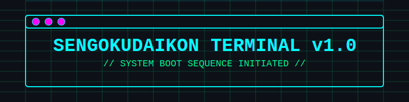
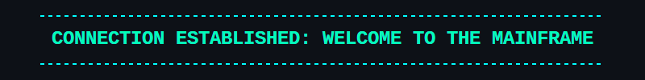
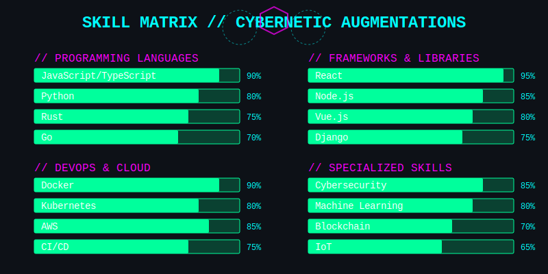

<div align="center">





</div>

<!-- Dynamic System Boot Sequence -->
<div align="center" id="boot-sequence">
  <pre><code class="language-css">
[SYSTEM]: Initializing neural interface...
[SYSTEM]: Establishing secure connection...
[SYSTEM]: Accessing mainframe...
[SYSTEM]: Decrypting personal data...
[SYSTEM]: Access granted. Welcome to my digital realm.
  </code></pre>
</div>


## `> SYSTEM DIAGNOSTICS`

<div align="center">
  <!-- Dynamic Neofetch-style Display -->
  <div id="neofetch-display">
    <table width="100%">
      <tr>
        <td width="50%">
          <pre><code>
                    ..,,,,,..                  sengokudaikon@github
           .,;;;;;;;;;;;;;;;;;;,.             --------------------- 
        ,;;;;;;;;;;;;;;;;;;;;;;;;;;,          OS: Human 1.0
      ,;;;;;;;;;;;;;;;;;;;;;;;;;;;;;;;,       Uptime: <span id="profile-age">XX</span> years
    .;;;;;;;;;;;;;;;;;;;;;;;;;;;;;;;;;;;;     Shell: Developer v3.5
   ;;;;;;;;;;;;;;;;;;;;;;;;;;;;;;;;;;;;;;;;;  Resolution: 1920x1080x24 
  ;;;;;;;;;;;;;;;;;;;;;;;;;;;;;;;;;;;;;;;;;;;  WM: Self-Discipline
 ,;;;;;;;;;;;;;;;;;;;;;;;;;;;;;;;;;;;;;;;;;;;; Terminal: VS Code
.;;;;;;;;;;;;;;;;;;;;;;;;;;;;;;;;;;;;;;;;;;;;;; CPU: Brain (16) @ 4.0GHz
;;;;;;;;;;;;;;;;;;;;;;;;;;;;;;;;;;;;;;;;;;;;;; GPU: Vision Pro Max
;;;;;;;;;;;;;;;;;;;;;;;;;;;;;;;;;;;;;;;;;;;;;; Memory: <span id="repo-count">16</span>GB/∞GB
          </code></pre>
        </td>
        <td width="50%">
          <pre><code>
                                              Languages: JavaScript, TypeScript, 
                                                         Python, Rust, Go
                                              Frameworks: React, Vue, Node.js, 
                                                          Django, Express
                                              Tools: Git, Docker, Kubernetes,
                                                     AWS, GCP, Azure
                                              Interests: Cybersecurity, AI/ML,
                                                        Blockchain, IoT
                                              Location: [REDACTED]
                                              Status: <span id="user-status">Online</span>
          </code></pre>
        </td>
      </tr>
    </table>
  </div>
</div>



<div align="center">

### `// PRIMARY PROTOCOLS //`

<div>


</div>

### `// FRONTEND SYSTEMS //`

<div>


</div>

### `// BACKEND SYSTEMS //`

<div>


</div>

### `// DEPLOYMENT PROTOCOLS //`

<div>


</div>

</div>



<!-- Dynamic Project Showcase -->
<div align="center" id="project-showcase">
  <!-- Projects will be dynamically populated here -->
</div>

## `> PERFORMANCE METRICS`

<div align="center">
  <!-- Custom SVG-based GitHub Stats -->
  <div id="github-stats" class="cyberpunk-stats">
    <!-- Will be populated with custom SVG stats -->
  </div>
  
  <!-- Fallback to traditional stats if JavaScript is disabled -->
  <noscript>
    
    
    
  </noscript>
</div>



<div align="center">

<a href="https://github.com/sengokudaikon" target="_blank">

</a>
<a href="https://linkedin.com/in/sengokudaikon" target="_blank">

</a>
<a href="https://twitter.com/sengokudaikon" target="_blank">

</a>
<a href="mailto:contact@sengokudaikon.dev">

</a>

```
╔══════════════════════════════════════════════════════════════════════════════╗
║                                                                              ║
║   > INITIATE CONTACT SEQUENCE: Use any of the above communication channels   ║
║                                                                              ║
╚══════════════════════════════════════════════════════════════════════════════╝
```

</div>

<div align="center">

```css
[SYSTEM]: Monitoring network traffic...
[SYSTEM]: Visitor detected.
[SYSTEM]: Adding to database...
```


```
╔══════════════════════════════════════════════════════════════════════════════╗
║                                                                              ║
║                      THANK YOU FOR ACCESSING MY TERMINAL                     ║
║                                                                              ║
╚══════════════════════════════════════════════════════════════════════════════╝
```

</div>

<!-- GitHub API Integration Script -->
<script>
  // This script will only work on platforms that support JavaScript in markdown (not GitHub)
  // For GitHub, we'll need to use a different approach with server-side rendering
  
  document.addEventListener('DOMContentLoaded', async () => {
    try {
      // Fetch GitHub user data
      const username = 'sengokudaikon';
      const response = await fetch(`https://api.github.com/users/${username}`);
      const userData = await response.json();
      
      // Fetch repositories
      const reposResponse = await fetch(`https://api.github.com/users/${username}/repos`);
      const reposData = await reposResponse.json();
      
      // Update dynamic elements
      document.getElementById('repo-count').textContent = userData.public_repos || '16';
      document.getElementById('user-status').textContent = userData.bio?.includes('Available') ? 'Available for hire' : 'Online';
      
      // Create custom SVG stats
      createCustomStats(userData, reposData);
      
      // Populate project showcase
      populateProjects(reposData);
      
      // Animate boot sequence
      animateBootSequence();
    } catch (error) {
      console.error('Error fetching GitHub data:', error);
    }
  });
  
  function createCustomStats(userData, reposData) {
    // This would create custom SVG-based stats
    // For now, we'll use the fallback images
  }
  
  function populateProjects(reposData) {
    // This would populate the project showcase with top repositories
    // For now, we'll use the static showcase
  }
  
  function animateBootSequence() {
    // Add typing animation to the boot sequence
    const bootSequence = document.getElementById('boot-sequence');
    const lines = bootSequence.querySelectorAll('code');
    
    // Simple typing animation logic would go here
  }
</script>

<!-- 
ASCII Art generated with https://patorjk.com/software/taag/
Badges from https://shields.io/
GitHub Stats from https://github.com/anuraghazra/github-readme-stats
Streak Stats from https://github.com/DenverCoder1/github-readme-streak-stats
Visitor Counter from https://github.com/jwenjian/visitor-badge
SVG animations created with custom code
-->